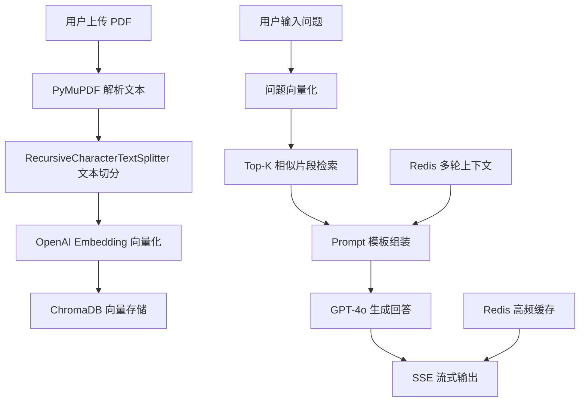

# rag-paper-assistant
A RAG-based paper reading assistant built with LangChain, ChromaDB, Flask and GPT-4o.
# RAG 智能论文阅读助手

本项目是一个面向实验室论文阅读场景的 RAG 智能问答系统。系统基于 LangChain、ChromaDB、OpenAI Embedding、GPT-4o、Flask 与 Redis 构建，支持 PDF 论文解析、向量检索、上下文问答、Prompt 模板切换、SSE 流式输出与高频问题缓存。

## 项目背景

实验室成员在阅读论文时，经常需要快速定位论文的研究背景、方法设计、实验结果、创新点和局限性。传统人工阅读耗时较长，直接使用大模型问答又容易产生幻觉。为了解决这个问题，本项目构建了一个基于 RAG 的论文智能阅读助手，使系统回答尽量基于论文原文内容生成，并支持通过页码信息进行答案回引。

## 核心功能

* PDF 论文解析：使用 PyMuPDF 解析 PDF 文本内容。
* 文本切分：使用 RecursiveCharacterTextSplitter 对论文内容进行分块。
* 向量化存储：使用 OpenAI text-embedding-3-small 生成文本向量，并写入 ChromaDB。
* RAG 问答：根据用户问题检索 Top-K 相关片段，再调用 GPT-4o 生成回答。
* 答案回引：metadata 保存 pdf_id 和 page_num，用于标记答案来源。
* 多轮上下文：使用 Redis List 维护最近 5 轮对话历史。
* 流式输出：使用 SSE 实现 token 级流式返回，降低等待感。
* 高频缓存：对高频问题进行缓存，减少重复调用大模型的成本。
* Prompt 模板：使用 YAML + Jinja2 管理摘要、关键词提取、论文对比等任务模板。

## 技术栈

| 模块        | 技术                             |
| --------- | ------------------------------ |
| 后端框架      | Flask                          |
| RAG 框架    | LangChain                      |
| 向量数据库     | ChromaDB                       |
| 文档解析      | PyMuPDF                        |
| 文本切分      | RecursiveCharacterTextSplitter |
| Embedding | OpenAI text-embedding-3-small  |
| 大模型       | GPT-4o                         |
| 缓存        | Redis                          |
| 流式输出      | Server-Sent Events             |
| Prompt 管理 | YAML + Jinja2                  |

## 系统架构



## 项目结构

```text
rag-paper-assistant/
├── README.md
├── requirements.txt
├── .env.example
├── .gitignore
├── app.py
├── config.py
├── rag/
│   ├── pdf_loader.py
│   ├── text_splitter.py
│   ├── vector_store.py
│   ├── retriever.py
│   ├── prompt_template.py
│   └── qa_chain.py
├── cache/
│   └── redis_cache.py
├── examples/
│   └── demo_qa.md
└── docs/
    └── architecture.md
```

## 快速开始

### 1. 克隆项目

```bash
git clone https://github.com/你的用户名/rag-paper-assistant.git
cd rag-paper-assistant
```

### 2. 创建虚拟环境

```bash
python -m venv .venv
```

Windows：

```bash
.venv\Scripts\activate
```

macOS / Linux：

```bash
source .venv/bin/activate
```

### 3. 安装依赖

```bash
pip install -r requirements.txt
```

### 4. 配置环境变量

复制 `.env.example` 为 `.env`，并填写自己的 API Key：

```bash
OPENAI_API_KEY=your_api_key_here
REDIS_HOST=localhost
REDIS_PORT=6379
CHROMA_PERSIST_DIR=./chroma_db
```

### 5. 启动服务

```bash
python app.py
```

服务启动后，可以通过接口上传 PDF 并进行论文问答。

## 示例问答

**问题：这篇论文的核心创新点是什么？**

系统会先检索论文中与 Method、Approach、Contribution 等相关的片段，再结合 Prompt 模板生成回答，并返回对应页码来源。

**问题：这篇论文用了哪些数据集？**

系统会优先检索 Dataset、Experiment、Implementation Details 等章节，并基于原文内容回答。

**问题：这篇论文有什么局限性？**

系统会检索 Limitation、Discussion、Conclusion 等相关部分，并总结论文中明确提到的问题。

## 效果评估

* 索引规模：约 8 万 chunks。
* 上下文管理：Redis List 维护最近 5 轮对话。
* 首字延迟：SSE 流式输出首字延迟低于 1 秒。
* 缓存命中：高频问题缓存命中率约 40%。
* 成本优化：外部 API 调用成本下降约 35%。
* 使用效果：10 人内测 A/B 对照，平均文献关键信息提取耗时由 15 分钟降至 6 分钟。

## 后续优化方向

* 接入 BM25 + 向量检索的 Hybrid Retrieval。
* 使用 RRF 融合排序提高复杂问题召回质量。
* 增加多论文对比问答功能。
* 增加 Recall@K、MRR、答案引用准确率等自动化评估指标。
* 增加前端页面，优化论文上传、问答和引用展示体验。

## 注意事项

本项目不包含真实 API Key、真实用户数据和未授权论文原文。运行前请自行配置 `.env` 文件。
